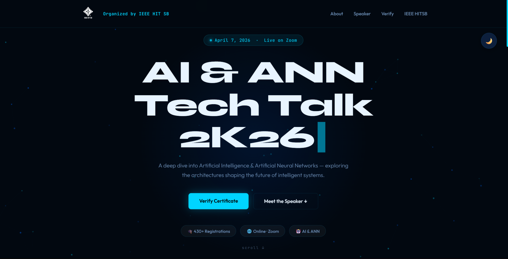
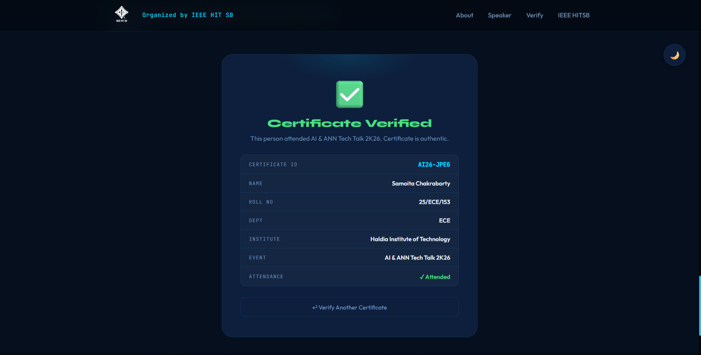
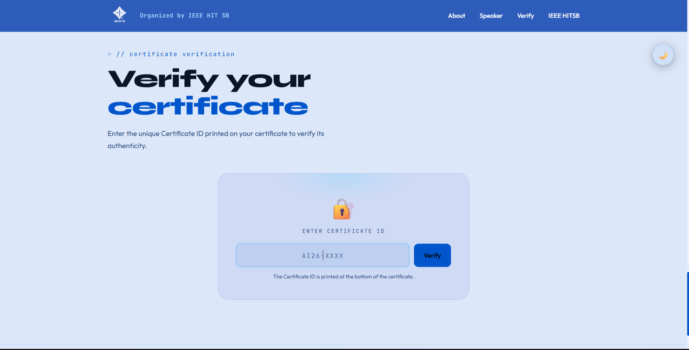

# 🎤 AI & ANN Tech Talk 2K26 — Certificate Verification System

A full-stack certificate verification system built for 
IEEE HITSB Tech Talk 2026, serving 430+ registered students.

## 🔗 Live Demo
[Visit Site](https://ieeehitsb.github.io/Certificate-Verify/)

## 🛠️ Tech Stack
- **Frontend** — HTML, CSS, JavaScript
- **Backend** — Google Apps Script (REST API)
- **Database** — Google Sheets
- **Hosting** — GitHub Pages
- **Other** — QR Code Integration

## ✨ Features
- Single QR code verification system for 430+ certificates
- REST API that queries live Google Sheets data
- Real-time certificate status — Verified / Not Attended / Fake
- Dark/Light mode toggle
- Fully mobile responsive with hamburger menu
- Auto-merged registration + attendance data via scripting
- Speaker profile with live LinkedIn integration
- Animated UI with particle effects and scroll animations

## 🏗️ System Architecture
Registration Form → Google Sheet → Apps Script API
→ Verification Website → QR Code on Certificate

## 📸 Screenshots

## 👨‍💻 Built By
Sattwik Dhara — for IEEE HITSB, Haldia Institute of Technology
